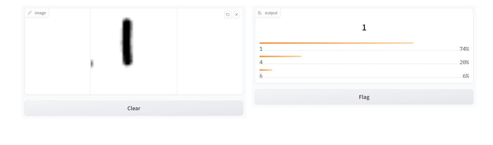

# 🎨 Digit Recognition App
<!-- Intro  -->
<h3 align="center">
  <samp>&gt; Welcome to the Digit Recognition App!</samp>
</h3>

<p align="center"> 
  <samp>
    <br>
    「 A simple app to recognize hand-drawn digits using a CNN model 」
    <br>
    <br>
  </samp>
</p>

<p align="center">
 <a href="https://your-website.com" target="blank">
  
 </a>
 <a href="https://linkedin.com/in/your-linkedin" target="_blank">
  
 </a>
 <a href="https://twitter.com/your-twitter" target="_blank">
  
 </a>
 <a href="https://instagram.com/your-instagram" target="_blank">
  
 </a> 
 <a href="https://facebook.com/your-facebook" target="_blank">
  
  </a> 
</p>

## ✨ Features

- **Digit Recognition:** The app can recognize hand-drawn digits (0-9) from user input.
- **Interactive Interface:** Users can draw digits on a canvas and get real-time predictions.
- **Top Predictions:** The app displays the top three predictions with their probabilities.

## 🖼️ Demo

Here's a screenshot of the app in action:



## 🛠️ Technologies Used


## 🚀 Installation

To run this application locally, follow these steps:

1. **Clone the repository:**
    ```sh
    git clone https://github.com/your-username/digit-recognition-app.git
    cd digit-recognition-app
    ```

2. **Install the required packages:**
    ```sh
    pip install numpy
    pip install tensorflow
    pip install gradio==3.39.0
    ```

## 🏃‍♂️ Running the Application

1. **Train the model:**
    ```sh
    python main.py
    ```

2. **Run the application:**
    ```sh
    python app.py
    ```

## 🎮 Usage

1. **Launch the app:** Once you run `python app.py`, the Gradio interface will be launched, and you can access it via a web browser.
2. **Draw a digit:** Use the canvas provided to draw a digit.
3. **Get Predictions:** The model will predict the digit and display the top three predictions with their probabilities.

## 📂 Code Overview

### `main.py`

- **Data Loading:** Loads the MNIST dataset.
- **Data Preprocessing:** Reshapes and normalizes the images.
- **Model Building:** Constructs a CNN with multiple layers.
- **Model Training:** Compiles and trains the model.
- **Model Saving:** Saves the trained model to `model.h5`.

### `app.py`

- **Model Loading:** Loads the pre-trained model.
- **Digit Recognition Function:** Defines a function to preprocess the input image and make predictions using the model.
- **Gradio Interface:** Sets up the Gradio interface to capture user input and display predictions.

## 🙏 Acknowledgments

- **TensorFlow/Keras:** For providing an excellent framework for building and training neural networks.
- **Gradio:** For making it easy to create interactive web interfaces for machine learning models.
- **MNIST Dataset:** For providing a standardized dataset for training and testing the digit recognition model.

## 📜 License

This project is licensed under the MIT License - see the [LICENSE](LICENSE) file for details.
